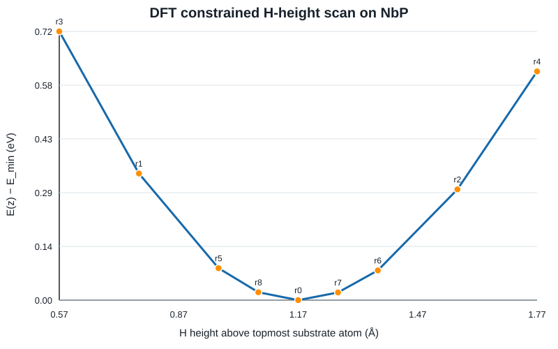
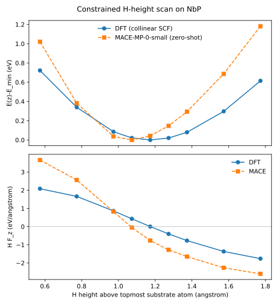
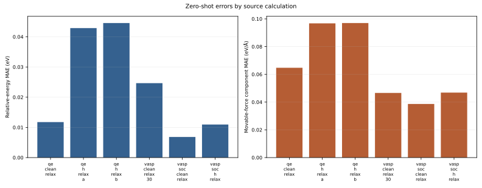
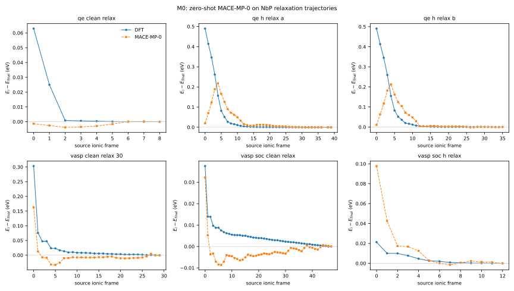
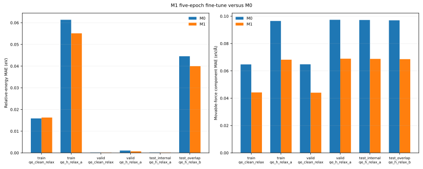
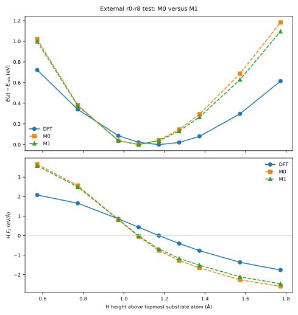
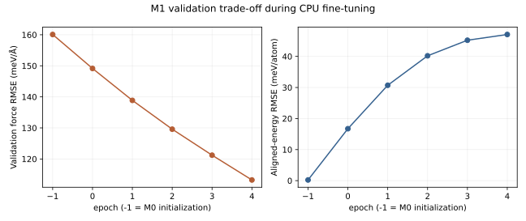

# Zero-shot MACE-MP-0 benchmark for H on NbP

This repository measures whether the pretrained MACE-MP-0 interatomic
potential transfers to hydrogen interacting with an NbP surface. The primary
test is a nine-point, fixed-composition DFT scan in which the substrate is
frozen and one H atom is displaced along `z`.

The project is deliberately baseline-first. It does not claim that MACE is
accurate, that fine-tuning helps, or that the scan is a desorption barrier.
Those conclusions are limited to the measured results reported below.



## Why this is a useful MLIP case study

The atomic geometries originated from SOC/noncollinear relaxations. The
reference energies and forces used here were then recalculated with non-SOC,
collinear, self-consistent DFT on those frozen geometries. Separating geometry
provenance from label provenance is central to the study.

NbP-H is a useful transfer test because it combines a surface, an adsorbate,
and an electronically unusual Weyl-semimetal substrate. More importantly, the
r0-r8 comparison is reference-invariant: every point contains the same atoms,
so `E(z) - E_min` is unaffected by arbitrary elemental energy offsets between
DFT and MACE.

This repository demonstrates:

- read-only auditing of legacy VASP data;
- explicit geometry and label provenance;
- separation of atomistic labels from DOS, band, Wannier, and transport output;
- force-aware, fixed-composition foundation-model evaluation;
- generated, machine-readable evidence rather than hand-copied results;
- an evidence-based decision on whether new labels and fine-tuning are justified.

## Data actually used

| Calculation | Geometry origin | Reference labels | Role |
|---|---|---|---|
| Clean 56-atom NbP slab | SOC relaxation | Collinear SCF | Clean reference |
| r0 NbP-H, 57 atoms | SOC-relaxed H-covered slab | Collinear SCF | Adsorbed reference and scan minimum |
| r1-r8 NbP-H | Frozen r0 substrate; H shifted along `z` | Collinear SCF | Primary held-out scan |
| H2, two atoms | Fixed 0.740 Å geometry | Collinear SCF | Candidate gas reference; currently flagged |
| Local H finite displacements | Frozen structure | Collinear finite differences | Optional secondary curvature check |

DOS, non-SCF, band-structure, Wannier, and transport calculations are completed
parts of the original electronic-structure work, but they do not add unique,
method-consistent atomistic labels for this MLIP benchmark.

## Measured input audit

The committed audit was generated from the private raw outputs on 2026-08-25:

- clean plus r0-r8 are all present with no duplicate or missing labels;
- all ten slab SCF jobs completed without a detected electronic error;
- all r0-r8 points contain complete 57-by-3 force arrays;
- all r0-r8 calculations share one collinear DFT method signature;
- all r0-r8 calculations have an identical substrate geometry;
- the successful r7/r8 reruns replace earlier failed archives;
- r0 is the lowest-energy sampled point;
- H heights span 0.573117 to 1.773117 Å above the topmost substrate atom.

The H2 SCF completed at `E(sigma->0) = -6.76275276 eV`, but the atoms retain
forces of `0.372344 eV/Å` and the lateral cell dimensions are inherited from
the slab (`3.358 Å × 3.358 Å`). It is therefore recorded as a candidate, not
yet accepted as a converged isolated-molecule reference. No final adsorption
energy is claimed from it.

See [`artifacts/scf_audit.json`](artifacts/scf_audit.json) and
[`artifacts/zscan_manifest.csv`](artifacts/zscan_manifest.csv) for the measured
records and SHA-256 provenance hashes.

## Measured zero-shot result

MACE-MP-0-small was evaluated without fitting on all nine r0-r8 structures.
Forces require no elemental reference correction, and the fixed-composition
energy curve requires no fitted elemental shift.



| Metric | Measured value |
|---|---:|
| Relative-energy MAE, all nine points | 0.1943 eV |
| Relative-energy RMSE | 0.2647 eV |
| Maximum relative-energy error | 0.5677 eV |
| Relative-energy Pearson correlation | 0.9445 |
| Near-minimum MAE (`DFT relative energy <= 0.10 eV`, 5 points) | 0.0903 eV |
| Short-range MAE (`z < 0.90 A`, 2 points) | 0.1703 eV |
| Large-height MAE (`z > 1.40 A`, 2 points) | 0.4783 eV |
| All force-component MAE | 0.0445 eV/A |
| H vertical-force MAE | 0.8057 eV/A |
| H vertical-force RMSE | 0.8926 eV/A |
| DFT sampled minimum | r0, 1.1731 A |
| MACE sampled minimum | r8, 1.0731 A |

The model captures the overall energy ordering well enough to produce a high
correlation, but it makes the interaction well too stiff: errors grow on the
large-height side, H-force magnitudes are systematically too large away from
the minimum, and the sampled minimum shifts by 0.10 A. The low aggregate
force-component MAE is not sufficient evidence by itself because the 56 slab
atoms dilute the error on the chemically active H coordinate.

## Expanded M0 relaxation benchmark

A second, calculation-blocked M0 benchmark evaluates all currently accepted
relaxation trajectories. It contains **177 parsed frames and 175 geometrically
unique frames within source calculation**. MACE-MP-0-small receives no fitting,
reference-energy calibration, or structures from these calculations during
training by this project.



| Source calculation | Unique frames | Relative-energy MAE (eV) | Movable-force component MAE (eV/A) | H-force component MAE (eV/A) |
|---|---:|---:|---:|---:|
| QE clean, collinear | 9 | 0.0118 | 0.0647 | -- |
| QE + H, collinear, run A | 39 | 0.0429 | 0.0968 | 0.4534 |
| QE + H, collinear, overlap run B | 36 | 0.0445 | 0.0970 | 0.4547 |
| VASP clean, collinear | 30 | 0.0246 | 0.0466 | -- |
| VASP clean, SOC/noncollinear | 48 | 0.0068 | 0.0386 | -- |
| VASP + H, SOC/noncollinear, incomplete | 13 | 0.0109 | 0.0468 | 0.2627 |

Relative energies are referenced to the final frame of each calculation, so
arbitrary composition-dependent energy offsets cancel. Forces are compared
directly, and the reported force metric includes only movable atoms. The two QE
H executions follow nearly the same relaxation path and are reported separately
as an overlap diagnostic, not treated as independent validation.



The foundation model is strongest on the clean SOC trajectory and reproduces
the ordering of the incomplete SOC+H path well. Its main weakness is the active
hydrogen force: H-component MAE is 0.453--0.455 eV/A on the QE H trajectories
and 0.263 eV/A for SOC+H. This measured gap motivates a carefully blocked
small-data fine-tuning experiment; it does not yet demonstrate that fine-tuning
will succeed.

## M1: measured small-data fine-tuning

M1 fine-tunes the M0 checkpoint for five CPU epochs using 32 QE collinear
structures. The split is contiguous by source frame: 10 structures are reserved
for validation and 6 late-relaxation structures form an internal test. A second
36-frame QE+H execution is retained only as an overlap diagnostic because it
follows nearly the same path. The complete r0--r8 scan remains external.



| Evaluation block | Metric | M0 | M1 | Change |
|---|---|---:|---:|---:|
| Internal QE+H test, 6 frames | H-force component MAE | 0.4334 eV/A | 0.3240 eV/A | -25.2% |
| Internal QE+H test | Movable-force component MAE | 0.0972 eV/A | 0.0688 eV/A | -29.3% |
| Internal QE+H test | Relative-energy MAE | 0.000120 eV | 0.0000867 eV | -27.9% |
| Overlap QE+H diagnostic, 36 frames | H-force component MAE | 0.4547 eV/A | 0.3509 eV/A | -22.8% |
| External r0--r8 scan, 9 frames | H vertical-force MAE | 0.8057 eV/A | 0.7180 eV/A | -10.9% |
| External r0--r8 scan | Relative-energy MAE | 0.1943 eV | 0.1695 eV | -12.8% |



The external improvement is the strongest evidence that M1 learned something
beyond memorizing adjacent relaxation frames. It is nevertheless modest: M1
still predicts `r8`, rather than the DFT `r0`, as the sampled minimum. The model
is therefore retained as a documented fine-tuning result, not presented as a
production Nb-P-H potential.

Training took 645.9 s for five epochs (80 gradient updates) on CPU. Validation
force RMSE decreased from 160.09 to 113.24 meV/A, while aligned absolute-energy
RMSE increased from 0.22 to 47.06 meV/atom under the force-focused loss. The
fixed-composition relative-energy tests above are therefore used for scientific
acceptance; the absolute-energy trade-off is reported rather than hidden.



## Reproduce the DFT audit

The raw VASP files remain local and are not committed. With the same directory
layout, run:

```powershell
python src\audit_scf.py `
  --scf-root $env:NBP_SCF_ROOT `
  --h2-dir $env:H2_SCF_DIR `
  --out artifacts `
  --dataset-out data\zscan.xyz
```

The script uses only the Python standard library. It writes portable
`raw://...` identifiers rather than publicizing local filesystem paths.
The coordinate-bearing `data/zscan.xyz` file is kept local and ignored by Git.

## Reproduce the zero-shot MACE-MP-0 result

```powershell
python src\eval_zscan.py --data data\zscan.xyz --model small --device cpu
```

The measured run used `mace-torch 0.3.16`, CPU PyTorch 2.13.0, ASE 3.29.0,
NumPy 2.5.2, and float64. Nine 57-atom predictions took 11.25 s after model
loading (1.25 s/structure). The exact working numerical stack is in
`requirements-lock.txt`; the checkpoint filename and SHA-256 hash are recorded
in `artifacts/mace_zeroshot.json`.

M0 contains no fitting. M1 uses the expanded relaxation labels with contiguous
trajectory blocks, never a random frame split. The entire r0-r8 family remains
outside training and hyperparameter selection as the external transfer test.

## Adsorption-energy status

For one H,

```text
E_ads = E(slab+H) - E(clean slab) - 0.5 E(H2)
```

The clean and H-covered slab terms are available as collinear single-point
energies on SOC-relaxed geometries. A final value is intentionally withheld
until a method-consistent, sufficiently isolated, near-equilibrium H2 reference
is verified or recalculated.

## Limitations

- The r0-r8 curve is a constrained one-dimensional cut, not a relaxed pathway,
  kinetic barrier, or minimum-energy path.
- Geometry optimization used SOC, while benchmark labels use collinear SCF.
- The relaxation data support a limited fine-tuning study, but not a claim of a
  general Nb-P-H potential or unrestricted molecular-dynamics reliability.
- No claim is made about electronic bands, Weyl points, Fermi arcs, DOS,
  Wannier Hamiltonians, or transport; an MLIP does not predict those outputs.
- No molecular dynamics, reactive sampling, high-temperature stability, or
  transfer beyond the measured NbP-H configurations has been validated.
- The available ZPE information is secondary and incomplete across states.

## Repository map

```text
src/audit_scf.py       reproducible DFT input audit and manifest generation
src/eval_zscan.py      primary zero-shot energy and H-force evaluation
src/build_benchmark_dataset.py  method-aware relaxation parsing and deduplication
src/eval_relaxations.py         expanded zero-shot relaxation benchmark
src/prepare_m1.py               blocked splits and training-only reference alignment
src/eval_m1.py                  controlled M0/M1 held-out comparison
src/eval_m1_zscan.py            external r0-r8 comparison
src/summarize_m1_training.py    training history and reproducibility hashes
configs/                        versioned fine-tuning configurations
docs/M1_PROTOCOL.md             leakage controls and acceptance criteria
artifacts/             small generated evidence committed to Git
tests/                 automated scientific and parsing checks
RUNBOOK.md             minimal reproduction commands and data policy
```

## Data availability

Raw VASP/QE outputs and coordinate-bearing structures are not distributed
through this repository because they belong to the broader source research
archive. The public artifacts contain derived scalar values, portable source
identifiers, and cryptographic hashes that trace results to the private
originals. The code, configuration, tests, tables, and figures are released
under the MIT License; the underlying DFT data are available from the author
subject to research-group approval.

## Status

**M0 and the five-epoch M1 study are complete.** Every numeric claim above is
backed by a generated JSON/CSV artifact. The result supports small-data transfer
learning experience while retaining explicit limits on generalization.

## License and citation

The repository software is available under the [MIT License](LICENSE). If you
reuse the workflow or results, cite this repository and the MACE publications
listed by the upstream [MACE project](https://github.com/ACEsuit/mace).
